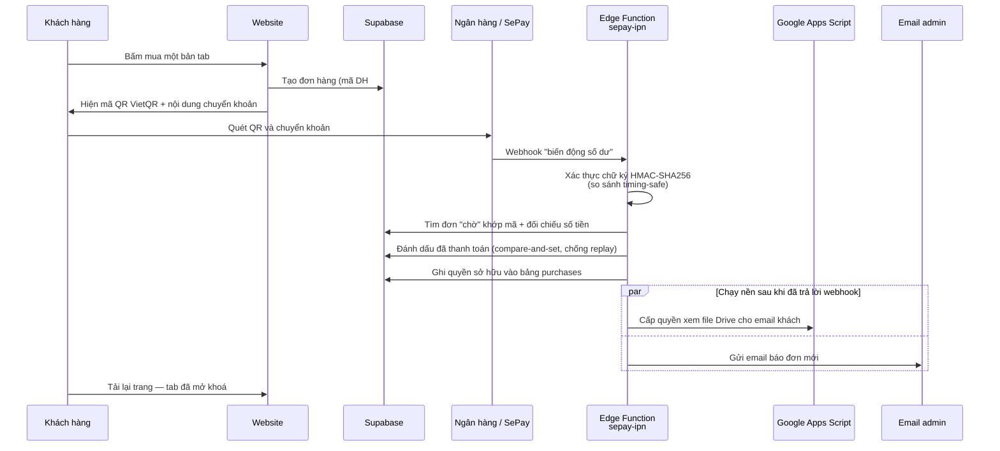

# Guitar By Quang

Nền tảng học guitar fingerstyle tiếng Việt: kho video tab, công cụ luyện tập và
hệ thống bán tab **tự động hoá hoàn toàn** — từ lúc khách quét mã QR chuyển
khoản đến lúc khách xem được video tab trên Google Drive, không cần một thao
tác thủ công nào của quản trị viên.

🔗 **Đang chạy tại:** [guitar-by-quang-v2.vercel.app](https://guitar-by-quang-v2.vercel.app)

---

## Mục lục

- [Điểm đáng chú ý về kỹ thuật](#điểm-đáng-chú-ý-về-kỹ-thuật)
- [Công nghệ sử dụng](#công-nghệ-sử-dụng)
- [Luồng thanh toán tự động](#luồng-thanh-toán-tự-động)
- [Xác minh thẻ học sinh/sinh viên bằng AI](#xác-minh-thẻ-học-sinhsinh-viên-bằng-ai)
- [Bảo mật](#bảo-mật)
- [Kiến trúc](#kiến-trúc)
- [Chạy dự án ở máy local](#chạy-dự-án-ở-máy-local)
- [Các quyết định kỹ thuật và lý do](#các-quyết-định-kỹ-thuật-và-lý-do)

---

## Điểm đáng chú ý về kỹ thuật

| | |
|---|---|
| **Thanh toán tự động** | Webhook ngân hàng (SePay) xác thực bằng HMAC-SHA256, chống replay, tự cấp quyền xem file Google Drive và gửi email báo đơn |
| **Bảo mật chủ động** | Row-Level Security ở tầng database, chống user enumeration, chống XSS lưu trữ, chống dò tài khoản qua thời gian phản hồi |
| **Kiểm thử bất biến bảo mật** | 126 test tự động, gồm chạy nguyên hàm webhook thanh toán với chữ ký HMAC thật và Supabase giả lập, chạy trong CI mỗi lần push |
| **AI có kiểm soát** | Gemini đọc thẻ HSSV để tự động giảm giá; chỗ nào AI chưa chắc thì chuyển cho quản trị viên duyệt thay vì từ chối nhầm, ảnh tự xoá sau vài ngày, có chống IDOR và kiểm tra quyền sở hữu đơn hàng |
| **Tối ưu mobile-first** | Toàn bộ giao diện thiết kế cho người Việt dùng điện thoại, mạng yếu — không SPA, không hydration |

---

## Công nghệ sử dụng

**Frontend**
- Vite (multi-page application — 13 trang HTML độc lập, không phải SPA)
- Vanilla JavaScript (ES Modules), không framework
- Tailwind CSS
- Three.js (mô hình guitar 3D ở trang chủ), GSAP + ScrollTrigger (animation)

**Backend & hạ tầng**
- Supabase: PostgreSQL, Authentication, Row-Level Security, Storage, Edge Functions (Deno)
- Google Apps Script (cấp quyền Google Drive tự động)
- SePay (webhook biến động số dư ngân hàng)
- Brevo (email giao dịch)
- Google Gemini (xác minh ảnh thẻ HSSV)
- Vercel (hosting + CI/CD)

**Chất lượng code**
- Vitest + jsdom (unit test)
- ESLint + Prettier
- GitHub Actions: lint → test → build mỗi lần push

---

## Luồng thanh toán tự động

Đây là phần phức tạp nhất của dự án. Toàn bộ quy trình dưới đây diễn ra trong
vài giây và **không cần quản trị viên can thiệp**:



**Các vấn đề đã xử lý trong luồng này:**

- **Chống giả mạo webhook:** mọi request phải có chữ ký HMAC-SHA256 hợp lệ,
  so sánh bằng thuật toán timing-safe để không lộ thông tin qua thời gian xử lý.
- **Chống xử lý trùng (replay):** việc đánh dấu đơn đã thanh toán dùng
  compare-and-set trên trạng thái `pending`, nên webhook bị gửi lại nhiều lần
  cũng chỉ cấp quyền đúng một lần.
- **Chống gian lận số tiền:** số tiền của đơn hàng được ràng buộc ở tầng
  database phải khớp đúng giá bài hát, khách không thể tự tạo đơn giá rẻ.
- **Không chặn phản hồi webhook:** việc cấp quyền Drive và gửi email chạy nền
  bằng `EdgeRuntime.waitUntil` sau khi đã trả lời SePay, tránh timeout.
- **Không bỏ sót tiền về:** mọi giao dịch ngân hàng được ghi vào bảng
  `bank_transactions`, kể cả khoản không khớp đơn nào (sai nội dung, trả muộn,
  chuyển thiếu). Khoản đó hiện ở trang "Tiền về" kèm gợi ý đơn cùng số tiền,
  admin gán bằng một cú bấm và nhận email báo ngay khi có tiền về mà chưa khớp.
- **Doanh thu không thiếu khi cấp tay:** cấp quyền với lý do "đã nhận tiền" mà
  khách chưa có đơn thì hệ thống tự tạo một đơn đã thanh toán để ghi doanh thu.

---

## Xác minh thẻ học sinh/sinh viên bằng AI

Khách là học sinh/sinh viên được giảm giá. Hệ thống tự xử lý phần rõ ràng và
chỉ chuyển cho quản trị viên phần AI chưa chắc:

1. Khách đồng ý cho dùng ảnh (nêu rõ mục đích và thời hạn lưu) rồi tải **một** ảnh
   thẻ lên bucket riêng tư, mỗi người chỉ ghi/đọc được đúng thư mục mang ID của mình.
2. Edge Function kiểm tra **ảnh có đúng nằm trong thư mục của người gọi không**
   (chống IDOR) và **đơn hàng có đúng của người đó không**.
3. Gemini đọc kỹ thẻ: có phải thẻ thật không, họ tên, trường, mã học sinh/sinh viên,
   năm hết hạn.
4. Một hàm quyết định thuần (có test riêng) chọn: **duyệt** (thẻ rõ, còn hạn, mã
   chưa dùng ở tài khoản khác → hạ giá đơn ngay), **chờ admin** (AI lỗi, ảnh mờ,
   thiếu mã, mã trùng tài khoản khác) hoặc **từ chối** (rõ ràng không phải thẻ,
   hoặc hết hạn). Lỗi của AI không bao giờ biến thành "từ chối" khách thật.
5. Quản trị viên xem lại ảnh và thông tin AI đọc được ở trang **Duyệt HSSV**, có thể
   duyệt hoặc thu hồi giảm giá. Mã học sinh/sinh viên chỉ lưu dạng băm một chiều để
   một thẻ không dùng cho nhiều tài khoản.
6. Ảnh tự xoá sau 3 ngày kể từ khi được xem lại, tối đa 30 ngày từ lúc tải lên
   (Edge Function chạy theo lịch, xoá file thật qua Storage API); chỉ giữ lại kết quả.

Giới hạn đã biết và chấp nhận có chủ đích: hệ thống không so khuôn mặt hay lưu dữ liệu
sinh trắc học — hai người cố tình cho nhau mượn thẻ vẫn qua được (mỗi thẻ chỉ giảm giá
cho một tài khoản). Rủi ro tài chính tối đa là phần chênh lệch giảm giá của một đơn, nên
không đáng đánh đổi bằng eKYC (từ chối nhầm khách thật, dữ liệu nhạy cảm, thêm ma sát).

---

## Bảo mật

Dự án được tự kiểm thử xâm nhập và vá các lỗ hổng tìm được. Một số ví dụ:

| Lỗ hổng | Cách khai thác | Cách vá |
|---|---|---|
| **Ghi đè dữ liệu** | RLS chỉ kiểm tra "đã đăng nhập", nên bất kỳ tài khoản thường nào cũng gọi được API sửa giá bài hát | Policy yêu cầu đúng vai trò admin |
| **Gian lận giá** | Client tự gửi số tiền khi tạo đơn → mua tab 239k với giá 1k | Ràng buộc số tiền phải khớp giá trong bảng `songs` |
| **XSS lưu trữ** | Đặt tên hiển thị là `` → chạy mã khi người khác mở menu | Escape toàn bộ dữ liệu người dùng trước khi render |
| **Lộ tài khoản hợp lệ** | Trang đăng nhập admin trả thông báo khác nhau cho "sai mật khẩu" và "đúng mật khẩu nhưng không phải admin" → dùng để dò danh sách rò rỉ | Gộp về một thông báo chung duy nhất |
| **Dò qua thời gian phản hồi** | Nhánh bị chặn mất nhiều lệnh gọi hơn nên phản hồi chậm hơn, dù thông báo giống nhau | Đệm mọi nhánh thất bại về cùng một mốc thời gian tối thiểu |

**Các bất biến bảo mật được khoá bằng test tự động** (chạy trong CI):

- Tài khoản admin không đăng nhập được qua cổng thành viên, và thông báo từ
  chối phải **giống hệt** thông báo sai mật khẩu.
- Luồng quên mật khẩu luôn trả về cùng một thông báo dù email có tồn tại hay
  không (chống user enumeration — CWE-204).
- Tài khoản thường bị từ chối ở cổng quản trị mà không để lộ lý do.

Ngoài ra: khoá bí mật (API key, secret webhook) lưu trong bảng chỉ service role
đọc được, không nhúng vào mã nguồn client; toàn bộ bảng đều bật Row-Level
Security với policy theo từng người dùng.

---

## Kiến trúc

```
├── *.html                  13 trang độc lập (multi-page, mỗi trang một entry Vite)
├── src/
│   ├── main.js             Trang chủ (hero 3D, bài nổi bật)
│   ├── kho-tab.js          Kho video tab: tìm kiếm, lọc, yêu thích, thanh toán
│   ├── user-dashboard.js   Trang cá nhân: tab đã mua, yêu thích, hồ sơ
│   ├── admin-dashboard.js  Điều phối trang quản trị
│   ├── luyen-cam-am.js     Game luyện cảm âm có bảng xếp hạng
│   ├── metronome.js        Máy gõ nhịp
│   ├── common.js           Header, menu, modal quên mật khẩu dùng chung
│   ├── admin/              Module quản trị, mỗi file một màn hình
│   │   ├── router.js       Router hash: mỗi mục quản trị là một URL riêng
│   │   ├── overview.js     Tổng quan: việc cần xử lý, doanh thu so cùng kỳ, biểu đồ
│   │   ├── payments.js     Tiền về: giao dịch ngân hàng chưa khớp đơn, gán cho khách
│   │   ├── orders.js       Đơn chờ thanh toán (tra cứu, ẩn đơn của khách đã sở hữu tab)
│   │   ├── grant.js        Cấp quyền thủ công theo 3 bước + khung tóm tắt
│   │   ├── history.js      Lịch sử mở khoá và thu hồi
│   │   ├── users.js        Danh sách thành viên
│   │   ├── user-detail.js  Hồ sơ chi tiết một thành viên
│   │   ├── settings.js     Cài đặt: hồ sơ, ảnh đại diện, mật khẩu, giao diện
│   │   ├── songs.js        CRUD kho video tab
│   │   ├── gears.js        CRUD bộ đồ nghề
│   │   ├── access.js       Thu hồi quyền xem tab (kèm gỡ quyền Drive)
│   │   ├── confirm.js      Hộp thoại xác nhận thay confirm() của trình duyệt
│   │   └── format.js       Hàm định dạng dùng chung
│   └── lib/                Tầng truy cập dữ liệu + tiện ích dùng chung
├── supabase/
│   ├── functions/          6 Edge Function (Deno)
│   │   ├── sepay-ipn/          Webhook ngân hàng → cấp quyền tự động, ghi mọi giao dịch
│   │   ├── verify-hssv-card/   Đọc thẻ HSSV bằng AI: duyệt / chờ admin / từ chối
│   │   ├── hssv-cleanup/       Tự xoá ảnh thẻ tới hạn (chạy theo lịch)
│   │   ├── admin-grant-access/ Cấp quyền thủ công + cấp quyền Drive
│   │   ├── admin-revoke-access/ Thu hồi quyền + gỡ quyền Drive
│   │   └── check-email-domain/ Kiểm tra domain email tồn tại khi đăng ký
│   └── migrations/         Script SQL cho các thay đổi schema
└── tests/                  Test cho các bất biến bảo mật
```

**Cơ sở dữ liệu:** `songs`, `gears`, `profiles`, `orders`, `purchases`,
`favorites`, `access_revocations`, `redemption_codes`, `app_secrets`,
`cam_am_leaderboard`, `cam_am_players` — tất cả đều bật RLS.

**Logic nghiệp vụ nhạy cảm** (cấp quyền, thống kê doanh thu, xoá người dùng)
đặt trong PostgreSQL function `SECURITY DEFINER` có tự kiểm tra vai trò admin
bên trong, thay vì tin vào việc client có gọi đúng hay không.

---

## Chạy dự án ở máy local

```bash
git clone https://github.com/quangdnnse184218/guitar-by-quang-v2.git
cd guitar-by-quang-v2
npm install
cp .env.local.example .env.local   # điền VITE_SUPABASE_URL và VITE_SUPABASE_ANON_KEY
npm run dev
```

| Lệnh | Công dụng |
|---|---|
| `npm run dev` | Chạy dev server |
| `npm run build` | Build production vào `dist/` |
| `npm run test` | Chạy test |
| `npm run lint` | Kiểm tra code |
| `npm run format` | Format code bằng Prettier |

---

## Các quyết định kỹ thuật và lý do

**Vì sao dùng multi-page thay vì SPA (React/Vue)?**
Người dùng chính là người Việt vào bằng điện thoại, nhiều người mạng yếu. Mỗi
trang ở đây là một trang nội dung độc lập (trang chủ, kho tab, công cụ) chứ
không phải một ứng dụng có trạng thái phức tạp. Multi-page cho HTML tĩnh sẵn
sàng ngay, không tốn thời gian hydration, tốt cho SEO — vốn là kênh tìm kiếm
chính của người học guitar. Cái giá phải trả là phải tự quản lý phần dùng
chung giữa các trang, nên header/auth/modal được gom vào `src/common.js`.

**Vì sao đặt logic quan trọng trong database function thay vì ở backend?**
Supabase để lộ REST API trực tiếp ra client, nên "backend" thật sự chính là
database. Đặt kiểm tra quyền trong RLS policy và `SECURITY DEFINER` function
nghĩa là dù kẻ tấn công gọi thẳng API bỏ qua giao diện thì vẫn bị chặn — đây là
bài học rút ra sau khi tự kiểm thử xâm nhập và phát hiện giao diện ẩn nút
không hề là một lớp bảo mật.

**Vì sao webhook lại tin cậy được?**
Vì endpoint webhook là công khai, nên nó không tin request đến từ đâu mà chỉ
tin chữ ký HMAC tính từ secret dùng chung. Cộng thêm ràng buộc số tiền ở
database và compare-and-set chống replay, một request giả mạo không thể tạo
ra quyền sở hữu.

**Vì sao cấp quyền Drive bằng Google Apps Script?**
Nội dung trả phí là video đặt trên Google Drive. Dùng Apps Script làm cầu nối
cho phép cấp quyền theo email khách mà không phải quản lý OAuth service
account phức tạp, đổi lại phải tự bảo vệ endpoint đó bằng secret riêng.

**Vì sao lệnh thu hồi Drive dùng tên field khác lệnh cấp?**
Bản Apps Script đầu tiên chỉ biết cấp quyền và bỏ qua mọi field lạ. Nếu lệnh
thu hồi gửi tới bản đó với cùng `fileId`/`email`, nó sẽ **cấp** quyền — đúng
ngược lại ý định, và im lặng. Nên payload thu hồi dùng `revokeFileId`/
`revokeEmail`, và URL của nó nằm ở khoá `app_secrets` riêng chỉ được set sau
khi đã deploy bản Apps Script có nhánh thu hồi. Mỗi lượt thu hồi ghi vào
`access_revocations` kèm cờ gỡ Drive thành công hay chưa.

**Vì sao trang quản trị dùng router hash thay vì tách thành nhiều file HTML?**
Trang quản trị cần 7 màn hình có URL riêng để F5 hay Back không mất chỗ đang
đứng. Tách thành 7 file `.html` đồng nghĩa với 7 bản sao của sidebar và header
— đúng thứ từng gây lệch header giữa các trang public trước đây. Router hash
giữ một khung giao diện duy nhất mà vẫn có URL thật cho từng màn hình, kể cả
link sâu tới hồ sơ một thành viên (`#/thanh-vien/<uuid>`).
